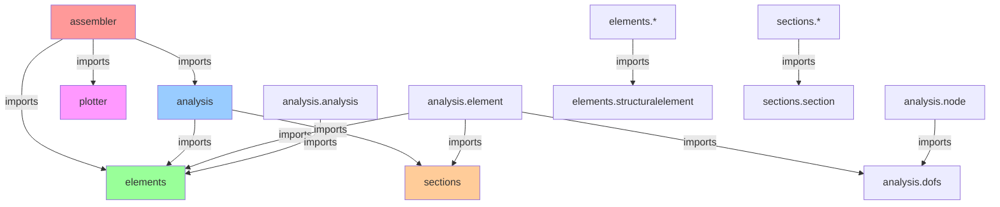
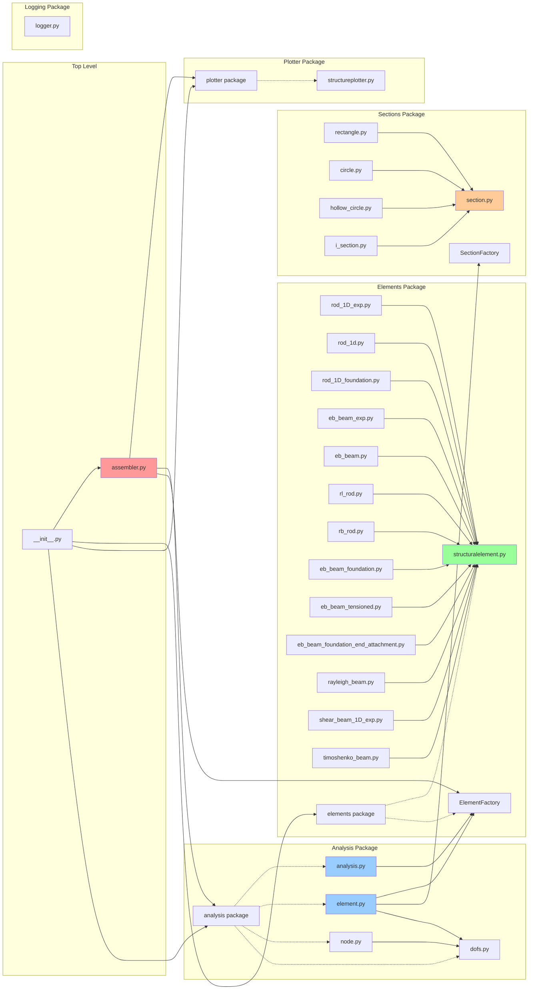

# PyDynSM Dependency Overview

**Purpose**: This document provides a comprehensive analysis of module dependencies, identifying import relationships, cycles, god modules, and unstable abstractions.

**Last Updated**: 2025-01-XX  
**Analyzed Codebase**: PyDynSM v0.2.6

---

## Module Import Graph

### Top-Level Package Structure

PyDynSM is organized into 6 main top-level packages:

1. **`assembler`** - Main user-facing API and orchestration layer
2. **`analysis`** - Core computational engine (DOF management, matrix assembly, solving)
3. **`elements`** - Library of structural element implementations
4. **`sections`** - Cross-sectional geometry definitions
5. **`plotter`** - Visualization and plotting functionality
6. **`logging`** - Logging infrastructure (currently minimal)

### Package-Level Dependency Graph



**Legend**:
- 🔴 **Red (assembler)**: User-facing entry point
- 🔵 **Blue (analysis)**: Core computational engine
- 🟢 **Green (elements)**: Element implementations
- 🟠 **Orange (sections)**: Section implementations
- 🟣 **Purple (plotter)**: Visualization

### Detailed Module Dependency Graph



---

## Dependency Metrics

### Fan-In (Incoming Dependencies)

**Fan-in** measures how many modules depend on a given module. High fan-in indicates a "god module" or central dependency.

| Module | Fan-In | Status |
|--------|--------|--------|
| `elements.structuralelement` | 13+ | 🔴 **God Module** |
| `sections.section` | 4 | 🟡 High |
| `analysis.dofs` | 2 | 🟢 Moderate |
| `elements.ElementFactory` | 3 | 🟡 High |
| `sections.SectionFactory` | 1 | 🟢 Low |
| `analysis.analysis` | 1 | 🟢 Low |
| `analysis.element` | 1 | 🟢 Low |
| `analysis.node` | 1 | 🟢 Low |

### Fan-Out (Outgoing Dependencies)

**Fan-out** measures how many modules a given module depends on. High fan-out indicates tight coupling.

| Module | Fan-Out | Status |
|--------|---------|--------|
| `assembler` | 3 | 🟡 Moderate |
| `analysis.element` | 3 | 🟡 Moderate |
| `analysis.analysis` | 1 | 🟢 Low |
| `elements.*` (all element types) | 1 | 🟢 Low |
| `sections.*` (all section types) | 1 | 🟢 Low |

### Instability Index

**Instability** = Fan-Out / (Fan-In + Fan-Out)

- **0.0**: Stable (many dependents, few dependencies) - "Foundation"
- **1.0**: Unstable (few dependents, many dependencies) - "Leaf"

| Module | Instability | Interpretation |
|--------|-------------|----------------|
| `elements.structuralelement` | 0.0 | 🟢 **Stable** - Foundation class |
| `sections.section` | 0.0 | 🟢 **Stable** - Foundation class |
| `analysis.dofs` | 0.33 | 🟢 **Stable** - Core utility |
| `assembler` | 1.0 | 🔴 **Unstable** - Depends on many, used by few |
| `analysis.element` | 0.75 | 🟡 **Unstable** - Depends on multiple subsystems |
| `elements.*` (concrete elements) | 1.0 | 🔴 **Unstable** - Leaf nodes |
| `sections.*` (concrete sections) | 1.0 | 🔴 **Unstable** - Leaf nodes |

---

## Cycle Detection

### Analysis

**No circular dependencies detected** in the top-level package structure. The dependency graph forms a **directed acyclic graph (DAG)**:

```
assembler → analysis → elements
assembler → elements
assembler → plotter
analysis.element → elements
analysis.element → sections
elements.* → elements.structuralelement
sections.* → sections.section
```

**Cycle-free architecture** ✅ - This is a healthy dependency structure.

### Potential Risk Areas

While no cycles exist, there are some **bidirectional dependencies** at the conceptual level:

1. **Analysis ↔ Elements**: 
   - `analysis.element` imports `ElementFactory` from `elements`
   - `elements` implementations are used by `analysis.analysis`
   - **Status**: ✅ Safe - No actual cycle, just usage dependency

2. **Analysis.Element ↔ Elements**:
   - `analysis.element` creates instances of `StructuralElement` from `elements`
   - `StructuralElement` implementations are independent
   - **Status**: ✅ Safe - One-way dependency

---

## God Modules

### Definition

**God modules** are modules with exceptionally high fan-in (many incoming dependencies). They represent central abstractions that many other modules depend on.

### Identified God Modules

#### 1. `elements.structuralelement` 🔴

**Fan-In**: 13+ (all concrete element implementations + `__init__.py`)

**Dependencies**:
- `rod_1D_exp.py`
- `rod_1D_foundation.py`
- `rod_1d.py`
- `rb_rod.py`
- `rl_rod.py`
- `eb_beam_exp.py`
- `eb_beam.py`
- `eb_beam_foundation.py`
- `eb_beam_tensioned.py`
- `eb_beam_foundation_end_attachment.py`
- `rayleigh_beam.py`
- `shear_beam_1D_exp.py`
- `timoshenko_beam.py`
- `elements/__init__.py`

**Analysis**:
- ✅ **Justified**: This is the abstract base class for all structural elements - high fan-in is expected and healthy
- ✅ **Stable**: Changes to this module affect all element implementations
- ⚠️ **Risk**: Modifications require careful consideration and testing of all derived classes

**Recommendation**: 
- Keep this module stable and well-tested
- Use abstract methods to enforce interface contracts
- Document breaking changes clearly

#### 2. `sections.section` 🟡

**Fan-In**: 4 (all concrete section implementations)

**Dependencies**:
- `rectangle.py`
- `circle.py`
- `hollow_circle.py`
- `i_section.py`

**Analysis**:
- ✅ **Justified**: Abstract base class for all sections - expected high fan-in
- ✅ **Stable**: Well-defined interface
- 🟢 **Low Risk**: Smaller impact surface than `structuralelement`

**Recommendation**: 
- Maintain stable interface
- Consider adding more section types if needed

---

## Unstable Abstractions

### Definition

**Unstable abstractions** are modules that:
1. Change frequently (based on git history or inferred from complexity)
2. Are imported widely (high fan-in) but also change often
3. Have high fan-out (depend on many modules)

### Identified Unstable Abstractions

#### 1. `assembler` 🔴

**Metrics**:
- **Fan-Out**: 3 (depends on `analysis`, `elements`, `plotter`)
- **Fan-In**: 1 (imported by `__init__.py`)
- **Instability**: 1.0 (unstable)
- **Complexity**: High (orchestrates all subsystems)

**Analysis**:
- ⚠️ **High coupling**: Depends on multiple subsystems
- ⚠️ **Orchestration layer**: Changes here affect user-facing API
- ⚠️ **Risk**: Modifications can break user code

**Recommendation**:
- Keep API stable
- Use dependency injection (already implemented ✅)
- Consider versioning for breaking changes

#### 2. `analysis.element` 🟡

**Metrics**:
- **Fan-Out**: 3 (depends on `ElementFactory`, `SectionFactory`, `dofs`)
- **Fan-In**: 1 (used by `assembler`)
- **Instability**: 0.75 (unstable)
- **Complexity**: Very High (~1199 lines)

**Analysis**:
- ⚠️ **Large file**: One of the largest files in the codebase
- ⚠️ **Multiple responsibilities**: Element container, DOF management, section handling
- ⚠️ **High coupling**: Depends on multiple subsystems

**Recommendation**:
- Consider splitting into smaller modules
- Extract DOF-related logic
- Extract section-related logic
- Reduce coupling through interfaces

#### 3. `analysis.analysis` 🟡

**Metrics**:
- **Fan-Out**: 1 (depends on `ElementFactory`)
- **Fan-In**: 1 (used by `assembler`)
- **Instability**: 0.5 (moderate)
- **Complexity**: High (~837 lines)

**Analysis**:
- ⚠️ **Large file**: Second largest file in codebase
- ⚠️ **Core logic**: Contains critical analysis algorithms
- 🟢 **Moderate coupling**: Only depends on `ElementFactory`

**Recommendation**:
- Consider splitting by functionality (stiffness assembly, solving, post-processing)
- Extract matrix operations into separate utilities
- Document algorithm dependencies clearly

---

## Dependency Patterns

### 1. Factory Pattern

**Pattern**: Both `ElementFactory` and `SectionFactory` use the factory pattern.

**Dependencies**:
- `ElementFactory` in `elements.structuralelement`
- `SectionFactory` in `sections.section`
- Used by: `assembler`, `analysis.element`, `analysis.analysis`

**Analysis**: ✅ Good pattern - decouples creation from usage

### 2. Abstract Base Classes

**Pattern**: `StructuralElement` and `Section` are ABCs.

**Dependencies**:
- All concrete implementations inherit from these
- No reverse dependencies

**Analysis**: ✅ Good pattern - enforces interface contracts

### 3. Dependency Injection

**Pattern**: `Assembler` injects dependencies at initialization.

**Dependencies**:
- `Assembler` receives `Node`, `Element`, `Analysis` classes
- Allows for testing and flexibility

**Analysis**: ✅ Good pattern - reduces coupling

### 4. Layered Architecture

**Pattern**: Clear layers: Assembler → Analysis → Elements → Sections

**Dependencies**:
- Top-down flow
- No bottom-up dependencies

**Analysis**: ✅ Good pattern - maintains separation of concerns

---

## Recommendations

### High Priority

1. **Monitor `elements.structuralelement`**:
   - Keep changes minimal and well-tested
   - Document all interface changes
   - Consider versioning for breaking changes

2. **Refactor `analysis.element`**:
   - Split into smaller, focused modules
   - Extract DOF management logic
   - Extract section handling logic
   - Target: < 500 lines per module

3. **Stabilize `assembler` API**:
   - Document public API clearly
   - Use semantic versioning
   - Consider deprecation warnings for breaking changes

### Medium Priority

4. **Split `analysis.analysis`**:
   - Extract matrix assembly logic
   - Extract solving logic
   - Extract post-processing logic
   - Target: < 400 lines per module

5. **Add dependency documentation**:
   - Document why each dependency exists
   - Document when dependencies can be removed
   - Regular dependency audits

### Low Priority

6. **Consider dependency injection for factories**:
   - Make factories injectable
   - Allow custom element/section registries
   - Improve testability

7. **Add dependency metrics to CI**:
   - Track fan-in/fan-out over time
   - Alert on new cycles
   - Monitor instability trends

---

## External Dependencies

### Third-Party Libraries

| Library | Used By | Purpose |
|---------|---------|---------|
| `numpy` | All modules | Numerical computations |
| `scipy` | `analysis.analysis` | Linear algebra (`scipy.linalg.inv`) |
| `matplotlib` | `plotter.structureplotter` | Visualization |
| `abc` | `elements.structuralelement`, `sections.section` | Abstract base classes |
| `collections` | `analysis.*` | Data structures (`defaultdict`) |
| `dataclasses` | `analysis.dofs` | DOF data structures |
| `typing` | `analysis.node` | Type hints |
| `inspect` | `elements.structuralelement`, `sections.section` | Factory registration |

**Analysis**: ✅ Minimal external dependencies - good for maintainability

---

## Dependency Health Score

### Overall Assessment: 🟢 **Healthy**

**Strengths**:
- ✅ No circular dependencies
- ✅ Clear layered architecture
- ✅ Good use of abstract base classes
- ✅ Minimal external dependencies
- ✅ Factory pattern for extensibility

**Areas for Improvement**:
- ⚠️ Some large files with high complexity
- ⚠️ `assembler` has high coupling (expected for orchestration layer)
- ⚠️ `analysis.element` could be split for better maintainability

**Risk Level**: 🟢 **Low** - Well-structured codebase with clear dependencies

---

## Appendix: Complete Import Map

### `assembler.py`
```python
from . import plotter
from . import analysis
from .elements import ElementFactory
```

### `analysis/analysis.py`
```python
from ..elements import ElementFactory
```

### `analysis/element.py`
```python
from ..elements import ElementFactory
from ..sections import SectionFactory
from .dofs import DOFContainer, DOF
```

### `analysis/node.py`
```python
from .dofs import DOF
from .dofs import DOFContainer
```

### `elements/*.py` (all element implementations)
```python
from .structuralelement import StructuralElement, ElementFactory
```

### `sections/*.py` (all section implementations)
```python
from .section import Section, SectionFactory
```

### `plotter/structureplotter.py`
```python
# No internal dependencies (only external: matplotlib, numpy)
```

### `logging/logger.py`
```python
# No internal dependencies
```

---

**Document Version**: 1.0  
**Generated**: 2025-01-XX  
**Next Review**: Recommended quarterly or after major refactoring
